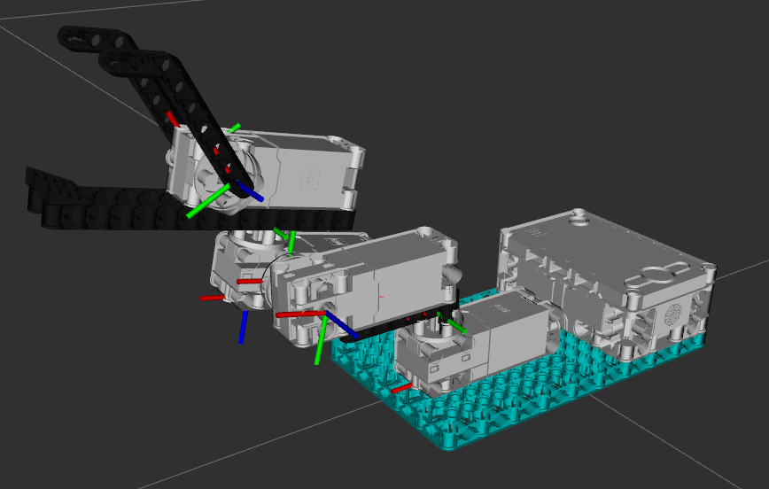

Lego Robot Inventor ROS
=========================

This repo contains code needed for operating the Lego Robot Inventor (#51515)
with ROS.

Everything is very much in development right now, but basic functionality has
been demonstrated in ROS Noetic running on Ubuntu 20.04.

This project uses the Lego Mindstorms or Lego Spike Prime hub as a serial
peripheral, with text-based data running between it and the main PC. No
ROS specific code runs on the Hub itself, allowing easier porting to ROS2
or other systems.

Currently only one hub per PC is supported, but this may change in the future.

Data published from the serial interface node runs at approximately 20Hz, but
you may see some variance right now.

Note that the Lego Spike Prime and Lego Mindstorms hardware is interchangeable.

The image above shows a simple robot arm built using components from the Lego Mindstorms Robot Inventor set #51515.
Building instructions and the URDF for this arm are included in the  `lego_spike_description` package.

NOTE: the STL meshes are currently bugged and have some wonky scale issues I haven't fixed yet.  Don't use them for
any high-precision tasks yet!

Packages
----------

- [`lego_spike_description`](lego_spike_description/README.md) -- URDF files and compatible meshes for adding Lego
  components to a larger ROS robot if desired
- [`lego_spike_interface`](lego_spike_interface/README.md) -- handles the low-level serial interfaces, publishes the
  majority of Lego-specific ROS topics
- [`lego_spike_msgs`](lego_spike_msgs/README.md) -- additional ROS messages used by `lego_spike_interface`
- [`lego_spike_viz`](lego_spike_viz/README.md) -- visualization plugins and launch files for viewing the Lego robot in
  Rviz

Note on Melodic
-----------------

The Noetic-devel branch has been successfully used on Ubuntu 18.04 with ROS Melodic installed.  You will need to install
the Python3 ROS libraries using `pip3`, or manually edit the scripts to invoke `python2` instead of `python3`.

Sources
---------

The following links contain useful information for working with the Lego Mindstorms Hub:

- Lego Mindstorms Robot Inventor https://www.lego.com/en-us/product/robot-inventor-51515
- Lego Spike Prime https://education.lego.com/en-us/products/lego-education-spike-prime-set/45678#spike%E2%84%A2-prime
- Lego Mindstorms Hub API https://lego.github.io/MINDSTORMS-Robot-Inventor-hub-API
- Lego Hub technical specs https://le-www-live-s.legocdn.com/sc/media/files/support/spike-prime/techspecs_techniclargehub-fba3b469ecb9eaafbde5f24d34ba090e.pdf
- Robot Inventor Tools https://github.com/ckumpe/robot-inventor-tools
- Additional useful examples: https://antonsmindstorms.com/2021/01/14/advanced-undocumented-python-in-spike-prime-and-mindstorms-hubs/
