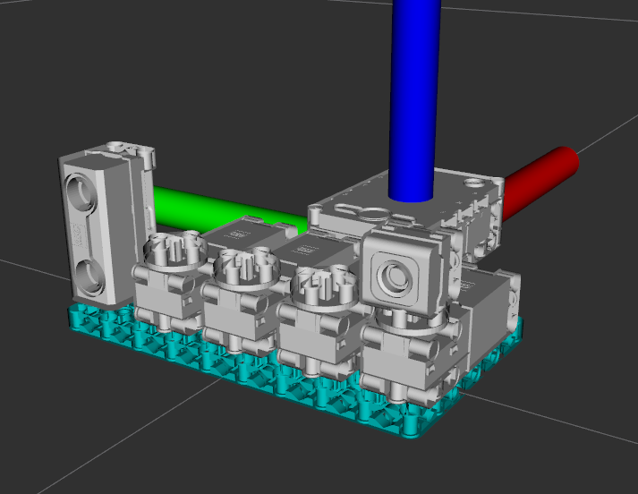

Lego Robot Inventor ROS
=========================

This repo contains code needed for operating the Lego Robot Inventor (#51515)
with ROS.

Everything is very much in development right now, so don't expect much to
work yet.

The intention is that the Mindstorms Hub will operate as a serial device,
sending and receiving messages over the USB (eventually maybe wi-fi and
bluetooth too), with the actual ROS data processing being done on the main
PC.  No ROS-specific code runs on the Mindstorms Hub.

Note that the Lego Spike Prime and Lego Mindstorms hardware is interchangeable.

Only one hub per PC is currently supported, though that may change in the future.



The image above shows a simple robot using the 4 motors and 2 sensors included in Lego Mindstors Robot Inventor, and
is included in the `lego_spike_description` package.  Its main purpose is just for debugging, rather than
demonstrating a practical robot.

NOTE: the STL meshes are currently bugged and have some wonky scale issues I haven't fixed yet.  Don't use them for
any high-precision tasks yet!


Usage
--------

Connect the Mindstorms Hub to your PC using the micro USB cable.  Start the driver with
```
roslaunch lego_spike_interface serial_interface.launch
```
or
```
rosrun lego_spike_interface serial_interface
```

By default the driver opens `/dev/lego` (symlink provided by the udev rule found in `lego_spike_interface/debian`) but
this can be configured using the `port` argument.  Baud rate is configurable for custom firmware, but currently
only `115200` shoud be used.

Topics
--------

Sensor data from the Hub is published on a variety of topics:

- `/colors` -- Color & light-level data from all connected light sensors
- `/distance` -- Distance reported by all ultrasonic distance sensors
- `/imu/data` -- Internal IMU gyroscope and accelerometer data
- `/joint_states` -- Joint positions and velocities of all connected motors

Topics under the `cmd` namespace are used for sending instructions to the Hub:
- `/cmd/goal_position` -- move the joints to the specified positions or at the specified speeds
- `/cmd/lights` -- send a 25-item row-major array to be displayed on the LED grid. Values should be brightness levels 0-9

The Lego motors provide both servo-like position control, operating from -180 to 180 degrees, or continuous, wheel-like
drive.  Both modes are suported by the `cmd/goal_position` topic:

- to move the motor to a specific angle, set the position variable to the desired angle, the effort to 1.0, and speed to 0.0
- to move the motor continuously at a specific speed, set set the speed to the desired speed, and the effort to 1.0. The position value is ignored
- to float the motor set the effort to 0.0. The position and speed will be ignored
- to lock the motor, set the effort to -1.0

Note that the speed is expressed as a [-1, 1] value indicating the percentage of maximum design speed; the actual maximum
speed appears to be undocumented, but if I ever figure it out I'll change it to use real units.

Currently only the position value of `cmd/goal_position` is used; effort and velocity must be set, but are ignored by
the underlying message-handler.  Motor names should begin with `motor_{a|b|c|d|e|f}` according to the port they are
attached to.  Multiple motors can be set, but the examples below just show a single one for clarity:

Set a motor to the zero position:
```
$ rostopic pub /cmd/goal_position sensor_msgs/JointState "name: ['motor_a_wheel_joint']
position: [0]
velocity: [0]
effort: [1]" -1
```

Turn a motor to 90 degrees:
Set a motor to the zero position:
```
$ rostopic pub /cmd/goal_position sensor_msgs/JointState "name: ['motor_a_wheel_joint']
position: [$(deg2rad 90)]
velocity: [0]
effort: [1]" -1
```

Rotate a motor continually at 20% of top speed:
```
$ rostopic pub /cmd/goal_position sensor_msgs/JointState "name: ['motor_a_wheel_joint']
position: [0]
velocity: [0.2]
effort: [1]" -1
```

Float the motor (parks it, but you can still turn it by hand)
```
$ rostopic pub /cmd/goal_position sensor_msgs/JointState "name: ['motor_a_wheel_joint']
position: [0]
velocity: [0]
effort: [0]" -1
```

Actively hold the motor at its current position:
```
$ rostopic pub /cmd/goal_position sensor_msgs/JointState "name: ['motor_a_wheel_joint']
position: [0]
velocity: [0]
effort: [-1]" -1
```

Example of setting 4 motors to different angles:
```
$ rostopic pub /cmd/goal_position sensor_msgs/JointState "name: ['motor_a_wheel_joint', 'motor_b_wheel_joint', 'motor_c_wheel_joint', motor_d_wheel_joint]
position: [$(deg2rad 90), $(deg2rad 45), $(deg2rad 0), $(deg2rad -45)]
velocity: [0, 0, 0, 0]
effort: [1, 1, 1, 1]" -1
```

Setting motors A and B to move to 90, motor C to spin one direction, and motor D the other:
```
$ rostopic pub /cmd/goal_position sensor_msgs/JointState "name: ['motor_a_wheel_joint', 'motor_b_wheel_joint', 'motor_c_wheel_joint', motor_d_wheel_joint]
position: [$(deg2rad 90), $(deg2rad 90), 0, 0]
velocity: [0, 0, 0.3, -0.1]
effort: [1, 1, 1, 1]" -1
```

Hold motor A, float motor B, spin motor C, move motor D to -45 degrees:
```
$ rostopic pub /cmd/goal_position sensor_msgs/JointState "name: ['motor_a_wheel_joint', 'motor_b_wheel_joint', 'motor_c_wheel_joint', motor_d_wheel_joint]
position: [0, 0, 0, $(deg2rad -45)]
velocity: [0, 0, 0.5, 0]
effort: [-1, 0, 1, 1]" -1
```


Sources
---------

The following links contain useful information for working with the Lego Mindstorms Hub:

- Lego Mindstorms Robot Inventor https://www.lego.com/en-us/product/robot-inventor-51515
- Lego Spike Prime https://education.lego.com/en-us/products/lego-education-spike-prime-set/45678#spike%E2%84%A2-prime
- Lego Mindstorms Hub API https://lego.github.io/MINDSTORMS-Robot-Inventor-hub-API
- Lego Hub technical specs https://le-www-live-s.legocdn.com/sc/media/files/support/spike-prime/techspecs_techniclargehub-fba3b469ecb9eaafbde5f24d34ba090e.pdf
- Robot Inventor Tools https://github.com/ckumpe/robot-inventor-tools
- Additional useful examples: https://antonsmindstorms.com/2021/01/14/advanced-undocumented-python-in-spike-prime-and-mindstorms-hubs/
